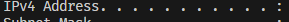

# 3d-portfolio-pro

A premium, responsive 3D portfolio (HTML/CSS/JS) with GSAP ScrollTrigger animations and an optimized Three.js particle hero.

## Features
- Responsive GSAP animations using gsap.matchMedia() (desktop: pinned horizontal projects; mobile: vertical list)
- Optimized particle hero (no per-particle physics loop per frame)
- Netlify Forms contact storage (deploy on Netlify to save submissions)
- Mobile menu + smooth anchor scroll
- Reduced-motion friendly

## File structure
-3d-portfolio-pro/
│
├── index.html
├── css/
│   ├── reset.css
│   ├── variables.css
│   ├── main.css
│   ├── hero.css
│   ├── about.css
│   ├── projects.css
│   └── contact.css
├── js/
│   ├── main.js
│   ├── scroll-animations.js
│   ├── particle-system.js
│   └── smooth-scroll.js
├── assets/
│   ├── images/
│   │   └── profilepic.avif
│   └── fonts/
└── README.md

## Run locally
Any static server works:

### VS Code Live Server
- Right click `index.html` → Open with Live Server

### OR
run ipconfig and find the  and the run Below cmd

### Python
python -m http.server 8000

### AFTER
use your IP Eg: 192.168.1.25:8000 on ur Browser.

## Deploy (Netlify recommended)
1. Push to GitHub
2. Import the repo into Netlify and deploy
3. Contact submissions appear in Netlify dashboard:
   Site → Forms

Netlify Forms requirements:
- `<form name="contact" method="POST" data-netlify="true">`
- Honeypot: `netlify-honeypot="bot-field"` + input named `bot-field`

## Customize
- Colors: `css/variables.css`
- Projects: edit the cards in `index.html`
- Project card sizing: `--project-w` in `css/variables.css`
